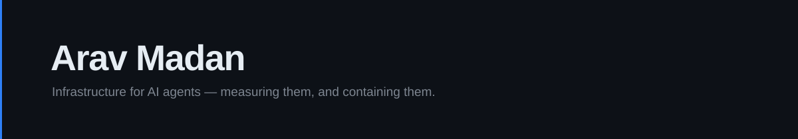

  

Third year CS at TU/e, in Eindhoven. I build the infrastructure around AI agents — the parts
that measure whether they work, and contain them when they don't.

**[Parkbench](https://github.com/aravmdn/parkbench)** · `in dev, MIT`
A benchmark arena for AI agents, built as a theme park. Seven rides across four axes; the
negotiation and exchange rides score against a provable optimum instead of a rubric.

**[Pitchr](https://pitchr.live)** · `live, MIT`
AI pitch coaching for founders. Live recording, transcription, async analysis runs, structured
scoring. Second-largest of four contributors.

**[Rampart](https://github.com/aravmdn/rampart)** · `paused, Apache-2.0`
AI coding agents run under enforced least privilege — Windows Job Objects, Low-Integrity
filesystem restriction, per-app-ID WFP outbound filters. Every block comes back with an
explanation instead of a silent failure. Works and still installable; no active development
since May 2026.

**[CollabBoards](https://github.com/aravmdn/CollabBoards)** · `shipped, MIT`
Real-time boards over Socket.IO with JWT access/refresh auth and a DB-backed integration suite.

**[CBL](https://github.com/aravmdn/CBL)** · `delivered`
A live installation where a singing bowl's pitch and a person's heartbeat drive the visuals,
GPU-side in TouchDesigner.

Most of my time goes to Parkbench. 440 tests, 75 decision records, zero runtime dependencies,
and every score reproducible byte-for-byte across runs, processes and operating systems.

### Elsewhere

1st place, AI Fixathon Amsterdam (Norrsken series), Dec 2025 · Zed Campus Ambassador, first cohort

Python, TypeScript, Rust, SQL. Next.js, Supabase, Tauri, TouchDesigner.

### Side quests

Basketball · modelling and runways · jazz, R&B and rap, mostly Frank Ocean.
Soulsborne when I feel like a masochist.

---

[LinkedIn](https://www.linkedin.com/in/aravmadan/) · [pitchr.live](https://pitchr.live)
